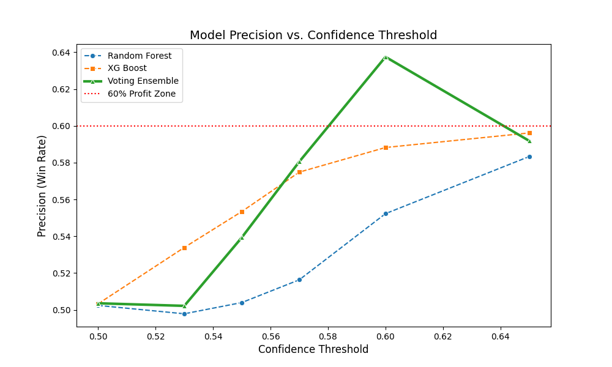

# V1 Model Performance Report: Limitations & Drawbacks

## Key Findings:

- Global ranking power is weak (ROC-AUC ≈ 0.50).
- Precision improves with higher confidence thresholds.
- Signal is concentrated in extreme probability tails.
- Coverage collapses to <1% at operational threshold (Precision ≈ 64%).
- Technical indicators alone insufficient for robust next-day prediction.

## Current Architecture:
 Input Features: 
  
  |     Feature      |                                                             Description                                                              |
  |:----------------:|:------------------------------------------------------------------------------------------------------------------------------------:|
  |   Dist_SMA_200   | Percentage distance of the closing price from the 200-day Simple Moving Average (SMA), used to capture long-term trend positioning.  |
  |   Dist_SMA_50    |                 Percentage distance of the closing price from the 50-day SMA, indicating medium-term trend strength.                 |
  |   Dist_SMA_20    |                 Percentage distance of the closing price from the 20-day SMA, reflecting short-term trend strength.                  |
  |   Trend_Speed    |                 Difference between the 20-day EMA an 20-Day SMA, used as a proxy for short-term trend acceleration.                  |
  |      14_RSI      |                   14-day Relative Strength Index (RSI), measuring recent price momentum on bounded scale (0-100).                    |
  |  MACD_Line_Norm  |   Moving Average Convergence Divergence (MACD) line normalized by the closing price to ensure scale invariance across securities.    |
  | MACD_Signal_Norm |                                          MACD signal line normalized by the closing price.                                           |
  |  MACD_Hist_Norm  |                                           MACD histogram normalized by the closing price.                                            |
  |   BB_Position    | Normalized position of the closing price within the Bollinger Band range, computed as (Close − LowerBand) / (UpperBand − LowerBand). |
  |     BB_Width     |              Relative Bollinger band width, calculated as (UpperBand - LowerBand) / SMA, serving as a volatility proxy.              |
  |     20_RVol      |                             20-day rolling average of trading volumes, representing baseline liquidity.                              |
  |    RSI_delta     |                                   3-day change in RSI, capturing short term momentum acceleration.                                   |
  | MACD_Hist_Delta  |                         2-day change in MACD Histogram, capturing short-term shifts in momentum divergence.                          |
  |    Vol_Surge     |                  Volume surge ratio relative to the 5-day average volume, used to detect abnormal trading activity.                  |

## Performance Metrics: 
### At varying thresholds:

<table>
<tr>
  <th>Model</th>
  <th>Threshold</th>
  <th>Number of Trades</th>
  <th>Precision</th>
  <th>Coverage</th>
</tr>
<tr>
  <td rowspan="6">Random Forest Classifier</td>
  <td>0.50</td>
  <td>13444</td>
  <td>0.5023</td>
  <td>0.5037</td>
</tr>
<tr>
  <td>0.53</td>
  <td>7173</td>
  <td>0.4978</td>
  <td>0.2669</td>
</tr>
<tr>
  <td>0.55</td>
  <td>4185</td>
  <td>0.5039</td>
  <td>0.1557</td>
</tr>
<tr>
  <td>0.57</td>
  <td>2146</td>
  <td>0.5163</td>
  <td>0.0798</td>
</tr>
<tr>
  <td>0.60</td>
  <td>679</td>
  <td>0.5522</td>
  <td>0.0252</td>
</tr>
<tr>
  <td>0.65</td>
  <td>96</td>
  <td>0.5833</td>
  <td>0.0035</td>
</tr>
<tr>
  <td rowspan="6">XG Boost Classifier</td>
  <td>0.50</td>
  <td>12159</td>
  <td>0.5032</td>
  <td>0.4525</td>
</tr>
<tr>
  <td>0.53</td>
  <td>2272</td>
  <td>0.5338</td>
  <td>0.0845</td>
</tr>
<tr>
  <td>0.55</td>
  <td>730</td>
  <td>0.5534</td>
  <td>0.0271</td>
</tr>
<tr>
  <td>0.57</td>
  <td>334</td>
  <td>0.5749</td>
  <td>0.0124</td>
</tr>
<tr>
  <td>0.60</td>
  <td>153</td>
  <td>0.5882</td>
  <td>0.0057</td>
</tr>
<tr>
  <td>0.65</td>
  <td>52</td>
  <td>0.5961</td>
  <td>0.0019</td>
</tr>
<tr>
  <td rowspan="6">Ensemble Voting Classifier</td>
  <td>0.50</td>
  <td>12956</td>
  <td>0.5036</td>
  <td>0.4822</td>
</tr>
<tr>
  <td>0.53</td>
  <td>4423</td>
  <td>0.5021</td>
  <td>0.1646</td>
</tr>
<tr>
  <td>0.55</td>
  <td>1628</td>
  <td>0.5393</td>
  <td>0.0605</td>
</tr>
<tr>
  <td>0.57</td>
  <td>565</td>
  <td>0.5805</td>
  <td>0.0210</td>
</tr>
<tr>
  <td>0.60</td>
  <td>160</td>
  <td>0.6375</td>
  <td>0.0059</td>
</tr>
<tr>
  <td>0.65</td>
  <td>49</td>
  <td>0.5918</td>
  <td>0.0018</td>
</tr>
</table>

### At 60% threshold:
  
  |           Model            | Precision  |   Recall   | F1 Score  | ROC-AUC  |
  |:--------------------------:|:----------:|:----------:|:---------:|:--------:|
  |  Random Forest Classifier  |  0.552283  |  0.027952  | 0.053210  | 0.504181 |
  |    XG Boost Classifier     |  0.588235  |  0.006708  | 0.013266  | 0.510212 |
  | Ensemble Voting Classifier |  0.637500  |  0.007603  | 0.015027  | 0.506257 |

### Interpretation (at 60% operational threshold):
* ROC - AUC
  * The model exhibits minimal global ranking power when predicting next-day direction using technical indicators alone.
  * Overall class separability remains weak

* Precision
  * At the operational threshold of 0.60, precision ranges from 55% (Random Forest) to 63.75% (Voting).
  * Although global separability is weak, predictive signal appears concentrated in the extreme upper tail of the probability distribution.
  * When confidence exceeds 0.6, win rate increases meaningfully.

* Recall:
  * Random forest classifier has the best recall of 2.8% indicating that the model is able to correctly identify 2 in 100 bullish days.
  * Recall for the Ensemble voting classifier drastically drops to 0.7% indicating that the models is able to correctly identify 7 in 1000 bullish days.
  * The model captures less than 1% of all bullish days at the operational threshold, indicating extreme selectivity and low signal coverage.

## The "Coin Flip" Baseline (Low Signal-to-Noise Ratio)
The most glaring issue is the baseline performance. At the default 0.50 threshold, precision approximates the base rate, indicating weak separability.

### Evidence:

* Random Forest Precision: 50.24%

* XG-Boost Precision: 50.32%

* Voting Precision: 50.36%

### Implication: 
The current feature set (Technical Indicators alone) contains too much "noise." The model detects a "bullish pattern" (e.g., RSI > 60), but without knowing if the market is crashing, that pattern is essentially random (50/50).

## Extreme "Opportunity Cost" (Confidence Filtering Reduces Signal Coverage)
To achieve precision above 60%, the model operates on less than 1% of total observations.

### Evidence:

* Voting Classifier: To improve precision from 50% (at 0.50 threshold) to 63.75% (at 0.60 threshold), the trade volume shrinks from 12,956 trades to only 160 trades.

### Implication: 
* The predictive signal exists primarily in extreme regions of feature space, suggesting weak separability in the mid-confidence range

## Poor Probability Calibration (The "0.65" Drop)
Higher confidence should always translate to higher accuracy, but the data reveals a discontinuity at the ends.

### Evidence:
* Voting Classifier: Precision reaches a maximum of 63.75% (at threshold 0.60) but then falls to 59.18% at the higher threshold of 0.65.

### Implication: 
The decline at 0.65 is likely due to small sample size instability rather than structural mis-calibration.

## Single-Stock Bias (Systematic Risk Ignorance)
The model looks at all stocks in isolation. The model lacks macro-level context features, such as index trend or sector strength, limiting its ability to account for systematic market risk.

# The Flaw: 
* Technical Analysis is most effective when done in tandem with the market trend. The absence of broader market context likely contributes to weak predictive performance, as individual stock movements are partially driven by index-level trends.
* The target column is set to be bullish when the current day ends higher than the previous day. This means that even a close of 0.1 above the previous day is a bullish move when it is most likely a sideways move.

# Conclusion:
V1 demonstrates that technical indicators alone provide weak next-day predictive power. 
While high-confidence regions exhibit non-random edge, overall class separability remains minimal, motivating structural improvements in V2.
