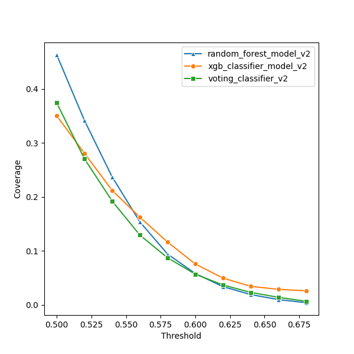
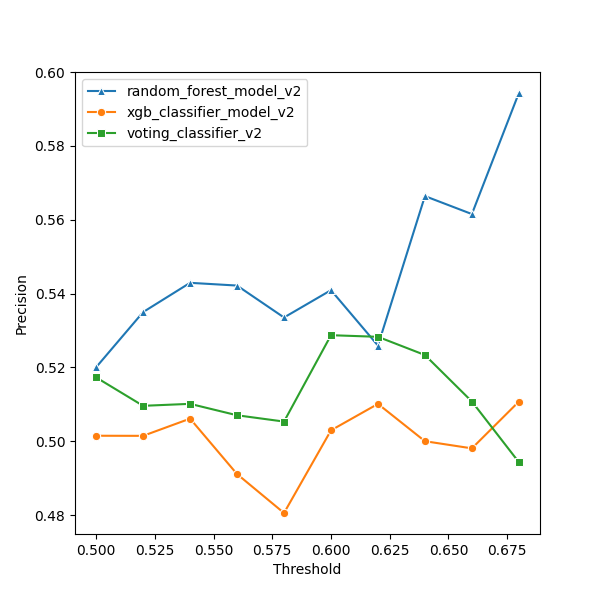
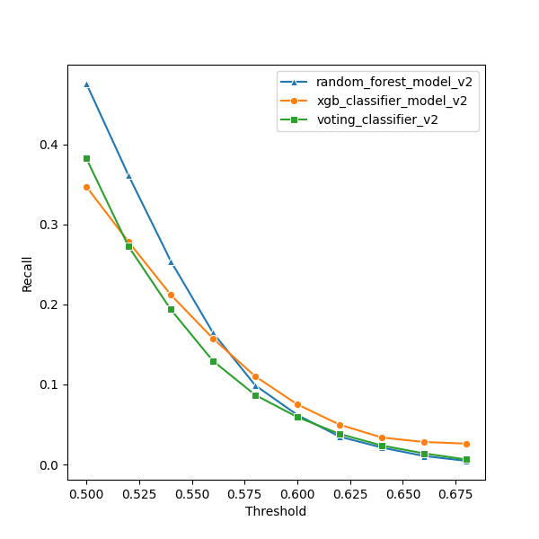
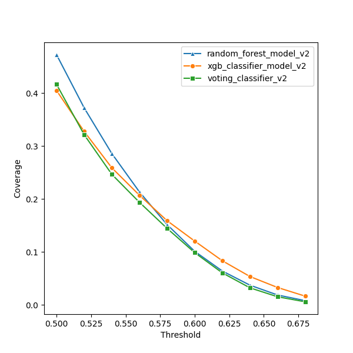
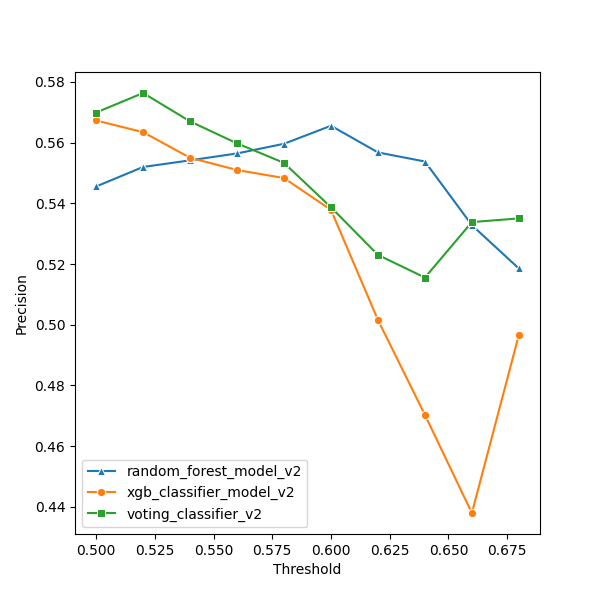
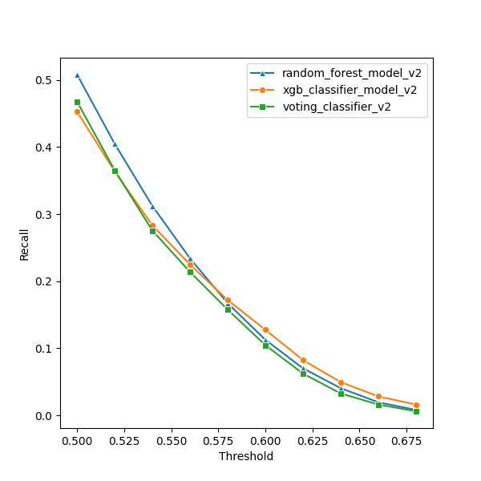
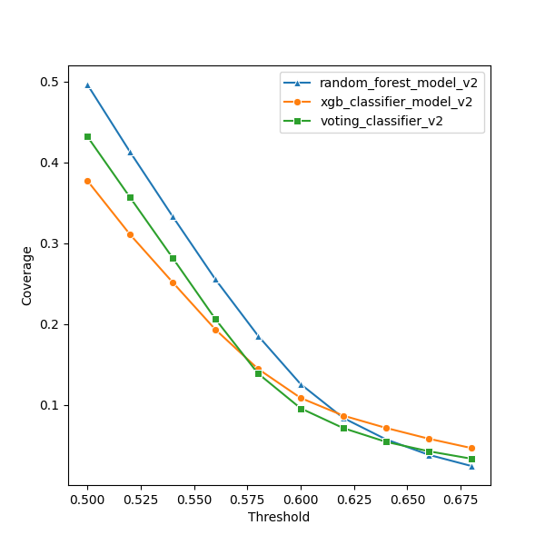
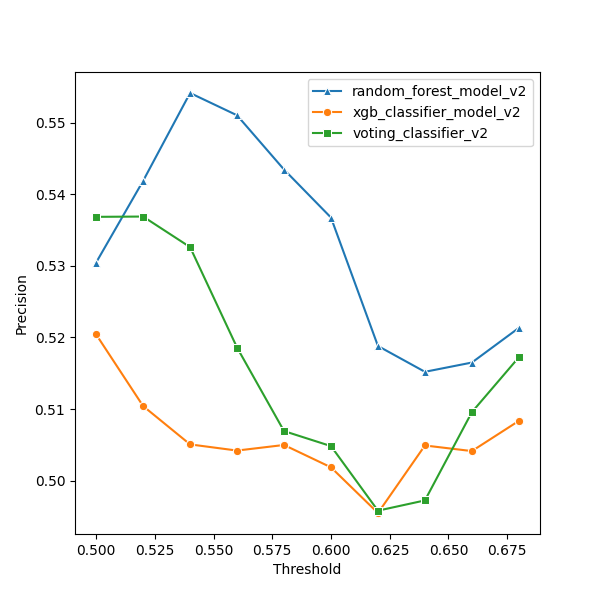
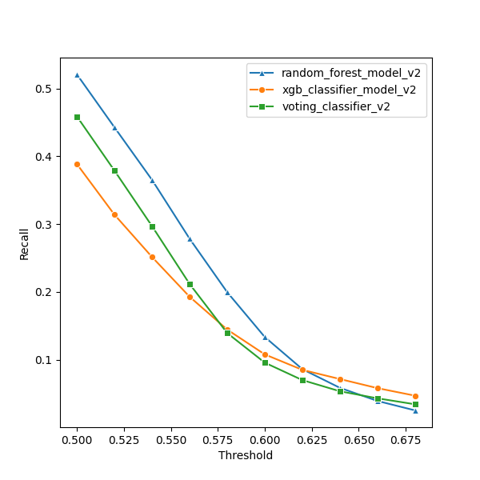

# V2 Model Performance report

Model 2 extends the baseline technical indicator feature set by incorporating market-level indicators to provide broader contextual information about prevailing market conditions.
The objective of this model iteration was to evaluate whether stock-level directional prediction could be improved through the inclusion of macro market signals such as
index returns, volatility and trend positioning. In addition to assessing the impact of index features, a series of controlled experiments were conducted to examine how predictive
performance varies across different forecast horizons (5-day, 10-day and 15-day). These experiments were designed to isolate the effect of alignment between input features and target definition,
and to determine the timescale over which the underlying signal expresses most clearly.
## 1. Feature Engineering
The feature set was designed to capture multiscale trend, momentum, volatility, and volume dynamics at both stock and market levels.
Stock level indicators model individual security behaviour, while index-level indicators provide broader market context.

All features were computed using only historical data, ensuring no forward-looking leakage.
### 1.1 Stock-Level technical indicators:

  |     Feature      |                                                             Description                                                              |
  |:----------------:|:------------------------------------------------------------------------------------------------------------------------------------:|
  |   Dist_SMA_200   | Percentage distance of the closing price from the 200-day Simple Moving Average (SMA), used to capture long-term trend positioning.  |
  |   Dist_SMA_50    |                 Percentage distance of the closing price from the 50-day SMA, indicating medium-term trend strength.                 |
  |   Dist_SMA_20    |                 Percentage distance of the closing price from the 20-day SMA, reflecting short-term trend strength.                  |
  |   Trend_Speed    |                 Difference between the 20-day EMA an 20-Day SMA, used as a proxy for short-term trend acceleration.                  |
  |      14_RSI      |                   14-day Relative Strength Index (RSI), measuring recent price momentum on bounded scale (0-100).                    |
  |  MACD_Line_Norm  |   Moving Average Convergence Divergence (MACD) line normalized by the closing price to ensure scale invariance across securities.    |
  | MACD_Signal_Norm |                                          MACD signal line normalized by the closing price.                                           |
  |  MACD_Hist_Norm  |                                           MACD histogram normalized by the closing price.                                            |
  |   BB_Position    | Normalized position of the closing price within the Bollinger Band range, computed as (Close − LowerBand) / (UpperBand − LowerBand). |
  |     BB_Width     |              Relative Bollinger band width, calculated as (UpperBand - LowerBand) / SMA, serving as a volatility proxy.              |
  |     20_RVol      |                             20-day rolling average of trading volumes, representing baseline liquidity.                              |
  |    RSI_delta     |                                   3-day change in RSI, capturing short term momentum acceleration.                                   |
  | MACD_Hist_Delta  |                         2-day change in MACD Histogram, capturing short-term shifts in momentum divergence.                          |
  |    Vol_Surge     |                  Volume surge ratio relative to the 5-day average volume, used to detect abnormal trading activity.                  |

### 1.2 Index-Level Indicators:
For each index (Nifty 50, Nifty Next 50)

  |      Feature      |                        Description                        |
  |:-----------------:|:---------------------------------------------------------:|
  |   index_ret_5d    |                5-day returns of the index.                |
  |   index_ret_20d   |               20-day returns of the index.                |
  | index_above_50SMA | Binary indicator showing if the index is above it 50 SMA. |
  |   index_20d_vol   |          20-day rolling volatility of the index           |
  |   index_14_RSI    |    14-day Relative Strength Index (RSI) of the index.     |

### 1.3 Target Definition:
 Target = 1 if Close(t + horizon) > Close(t), else 0

 Horizons tested:
 - 5 days.
 - 10 days.
 - 15 days.

## 2.1 Experiment 1 - 5-day horizon with index features.

### Hypothesis
Incorporating market-level index indicators alongside stock-level technical features will improve short-term
directional prediction performance at a 5-day forecast horizon by providing broader contextual information about 
prevailing market trends and volatility.

### Experimental Setup
 * Target: 5-day forward directional movement
 * Features: Stock-level technical indicators + index-level market indicators.
 * Models evaluated: Random Forest, XGBoost Classifier, Voting Ensemble.
 * Training period: 2017 - 2024
 * Testing period: 2025
 * Evaluation metrics: 
   * ROC-AUC (primary)
   * Precision
   * Recall
   * Coverage across probability thresholds.

### Results summary (Test Set)

<table>
   <thead>
      <tr>
         <th>Model</th>
         <th>Threshold</th>
         <th>Coverage</th>
         <th>Precision</th>
         <th>ROC AUC</th>
      </tr>
   </thead>
   <tbody>
      <tr>
         <td rowspan="10"><b>random_forest_model_v2</b></td>
         <td>0.5</td>
         <td>0.463395</td>
         <td>0.520038</td>
         <td  rowspan="10">0.5179</td>
      </tr>
      <tr>
         <td>0.52</td>
         <td>0.341736</td>
         <td>0.534982</td>
      </tr>
      <tr>
         <td>0.54</td>
         <td>0.237128</td>
         <td>0.542911</td>
      </tr>
      <tr>
         <td>0.56</td>
         <td>0.153835</td>
         <td>0.542169</td>
      </tr>
      <tr>
         <td>0.58</td>
         <td>0.094006</td>
         <td>0.533517</td>
      </tr>
      <tr>
         <td>0.6</td>
         <td>0.057975</td>
         <td>0.540921</td>
      </tr>
      <tr>
         <td>0.62</td>
         <td>0.033621</td>
         <td>0.52591</td>
      </tr>
      <tr>
         <td>0.64</td>
         <td>0.018979</td>
         <td>0.566406</td>
      </tr>
      <tr>
         <td>0.66</td>
         <td>0.009638</td>
         <td>0.561538</td>
      </tr>
      <tr>
         <td>0.68</td>
         <td>0.003929</td>
         <td>0.59434</td>
      </tr>
      <tr style="border-top: 1px solid #ccc;">
         <td rowspan="10"><b>xgb_classifier_model_v2</b></td>
         <td>0.5</td>
         <td>0.350447</td>
         <td>0.501481</td>
         <td rowspan="10">0.501048</td>
      </tr>
      <tr>
         <td>0.52</td>
         <td>0.280906</td>
         <td>0.501452</td>
      </tr>
      <tr>
         <td>0.54</td>
         <td>0.212181</td>
         <td>0.506115</td>
      </tr>
      <tr>
         <td>0.56</td>
         <td>0.162361</td>
         <td>0.491096</td>
      </tr>
      <tr>
         <td>0.58</td>
         <td>0.116247</td>
         <td>0.480548</td>
      </tr>
      <tr>
         <td>0.6</td>
         <td>0.07562</td>
         <td>0.502941</td>
      </tr>
      <tr>
         <td>0.62</td>
         <td>0.049487</td>
         <td>0.510112</td>
      </tr>
      <tr>
         <td>0.64</td>
         <td>0.034177</td>
         <td>0.5</td>
      </tr>
      <tr>
         <td>0.66</td>
         <td>0.028654</td>
         <td>0.49806</td>
      </tr>
      <tr>
         <td>0.68</td>
         <td>0.025911</td>
         <td>0.51073</td>
      </tr>
      <tr style="border-top: 1px solid #ccc;">
         <td rowspan="10"><b>voting_classifier_v2</b></td>
         <td>0.5</td>
         <td>0.374282</td>
         <td>0.517282</td>
         <td rowspan="10">0.510587</td>
      </tr>
      <tr>
         <td>0.52</td>
         <td>0.270675</td>
         <td>0.509586</td>
      </tr>
      <tr>
         <td>0.54</td>
         <td>0.192275</td>
         <td>0.510121</td>
      </tr>
      <tr>
         <td>0.56</td>
         <td>0.129258</td>
         <td>0.507026</td>
      </tr>
      <tr>
         <td>0.58</td>
         <td>0.087148</td>
         <td>0.505317</td>
      </tr>
      <tr>
         <td>0.6</td>
         <td>0.056789</td>
         <td>0.528721</td>
      </tr>
      <tr>
         <td>0.62</td>
         <td>0.036698</td>
         <td>0.528283</td>
      </tr>
      <tr>
         <td>0.64</td>
         <td>0.02302</td>
         <td>0.523349</td>
      </tr>
      <tr>
         <td>0.66</td>
         <td>0.01379</td>
         <td>0.510753</td>
      </tr>
      <tr>
         <td>0.68</td>
         <td>0.006524</td>
         <td>0.494318</td>
      </tr>
   </tbody>
</table>

At higher probability thresholds (e.g., 0.60)
* Precision ranged between ~0.50-0.56 across models.
* Recall declined rapidly with increasing threshold.
* Coverage decreased significantly beyond mid-range thresholds.

### Observations
1. Class separation remained weak across all models (AUC ~ 0.51-0.52).
2. Precision improvements were marginal and inconsistent.
3. Recall dropped sharply as threshold increased.
4. Inclusion of index-level indicators did not materially enhance short-horizon performance.

### Conclusion
Adding market-level contextual indicators did not meaningfully improve predictive
performance at the 5-day horizon.
This suggests the short-term price direction is pre-dominantly influenced by noise, and
the additional macro context is insufficient to resolve this variability at shorter forecast windows.

<table style="border: 1px solid #ccc;">
  <tr>
    <td style="padding: 10px;"></td>
    <td style="padding: 10px;"></td>
  </tr>
  <tr>
    <td style="padding: 10px;"></td>
    <td style="padding: 10px;"></td>
  </tr>
</table>

## 2.2 Experiment 2: 10-day horizon with Index features

### Hypothesis
Predictive signal derived from technical and index-level indicators may resolve more effectively over a medium-term forecast horizon,
when short-term market noise is reduced and directional momentum becomes more structurally observable.

### Experimental Setup
The feature set and model configurations remained identical to Experiment 2.1.
The only modification introduced in this experiment was the prediction horizon, which
was extended from 5 days to 10 days.
* Target: 10-day forward directional movement.
* Features: Stock-level technical indicators + Index-level market indicators.
* Models evaluated: Random Forest, XGBoost, Voting Ensemble.
* Training Period: 2017 - 2024.
* Testing Period: 2025
* Evaluation metrics: 
  * ROC-AUC (primary).
  * Precision.
  * Recall.
  * Coverage across probability thresholds.

### Results Summary (Test Set)

<table>
   <thead>
      <tr>
         <th>Model</th>
         <th>Threshold</th>
         <th>Coverage</th>
         <th>Precision</th>
         <th>ROC AUC</th>
      </tr>
   </thead>
   <tbody>
      <tr>
         <td rowspan="10"><b>random_forest_model_v2</b></td>
         <td>0.5</td>
         <td>0.472773</td>
         <td>0.545554</td>
         <td rowspan="10">0.537389</td>
      </tr>
      <tr>
         <td>0.52</td>
         <td>0.372243</td>
         <td>0.551982</td>
      </tr>
      <tr>
         <td>0.54</td>
         <td>0.286021</td>
         <td>0.554173</td>
      </tr>
      <tr>
         <td>0.56</td>
         <td>0.213441</td>
         <td>0.556443</td>
      </tr>
      <tr>
         <td>0.58</td>
         <td>0.151685</td>
         <td>0.559629</td>
      </tr>
      <tr>
         <td>0.6</td>
         <td>0.101197</td>
         <td>0.565568</td>
      </tr>
      <tr>
         <td>0.62</td>
         <td>0.063980</td>
         <td>0.556779</td>
      </tr>
      <tr>
         <td>0.64</td>
         <td>0.037217</td>
         <td>0.553785</td>
      </tr>
      <tr>
         <td>0.66</td>
         <td>0.018646</td>
         <td>0.532803</td>
      </tr>
      <tr>
         <td>0.68</td>
         <td>0.008007</td>
         <td>0.518519</td>
      </tr>
      <tr style="border-top: 1px solid #ccc;">
         <td rowspan="10"><b>xgb_classifier_model_v2</b></td>
         <td>0.5</td>
         <td>0.405049</td>
         <td>0.567310</td>
         <td rowspan="10">0.551888</td>
      </tr>
      <tr>
         <td>0.52</td>
         <td>0.327687</td>
         <td>0.563462</td>
      </tr>
      <tr>
         <td>0.54</td>
         <td>0.259073</td>
         <td>0.555015</td>
      </tr>
      <tr>
         <td>0.56</td>
         <td>0.207214</td>
         <td>0.550984</td>
      </tr>
      <tr>
         <td>0.58</td>
         <td>0.159136</td>
         <td>0.548334</td>
      </tr>
      <tr>
         <td>0.6</td>
         <td>0.120547</td>
         <td>0.537823</td>
      </tr>
      <tr>
         <td>0.62</td>
         <td>0.083367</td>
         <td>0.501556</td>
      </tr>
      <tr>
         <td>0.64</td>
         <td>0.053601</td>
         <td>0.470263</td>
      </tr>
      <tr>
         <td>0.66</td>
         <td>0.032843</td>
         <td>0.437923</td>
      </tr>
      <tr>
         <td>0.68</td>
         <td>0.016496</td>
         <td>0.496629</td>
      </tr>
      <tr style="border-top: 1px solid #ccc;">
         <td rowspan="10"><b>voting_classifier_v2</b></td>
         <td>0.5</td>
         <td>0.416651</td>
         <td>0.569929</td>
         <td rowspan="10">0.552123</td>
      </tr>
      <tr>
         <td>0.52</td>
         <td>0.321570</td>
         <td>0.576369</td>
      </tr>
      <tr>
         <td>0.54</td>
         <td>0.246729</td>
         <td>0.567007</td>
      </tr>
      <tr>
         <td>0.56</td>
         <td>0.193832</td>
         <td>0.559763</td>
      </tr>
      <tr>
         <td>0.58</td>
         <td>0.144568</td>
         <td>0.553333</td>
      </tr>
      <tr>
         <td>0.6</td>
         <td>0.098677</td>
         <td>0.538693</td>
      </tr>
      <tr>
         <td>0.62</td>
         <td>0.060459</td>
         <td>0.522992</td>
      </tr>
      <tr>
         <td>0.64</td>
         <td>0.032213</td>
         <td>0.515535</td>
      </tr>
      <tr>
         <td>0.66</td>
         <td>0.015346</td>
         <td>0.533816</td>
      </tr>
      <tr>
         <td>0.68</td>
         <td>0.005820</td>
         <td>0.535032</td>
      </tr>
   </tbody>
</table>

Relative to the 5-day horizon:
* ROC-AUC improved to approximately ~0.55 across ensemble models.
* Recall increased meaningfully at mid-range thresholds.
* Precision remained stable across the 0.52-0.56 threshold range.
* F1 scores improved across all evaluated models.

### Observations
1. Class separation improved materially compared to the 5-day experiment.
2. Predictive signal became more stable across probability thresholds.
3. Recall increased without significant degradation in precision.
4. Performance gains were achieved without altering feature composition.

### Conclusion
Extending the prediction horizon to 10 days resulted in a measurable improvement in class separation,
suggesting that the predictive signal captured by the technical and index feature set expresses more clearly over a medium-term
timeframe. This indicates that short-term noise may obscure underlying momentum effects at lower horizons, which become more detectable when evaluated over longer forecast windows.

<table style="border: 1px solid #ccc;">
  <tr>
    <td style="padding: 10px;"></td>
    <td style="padding: 10px;"></td>
  </tr>
  <tr>
    <td style="padding: 10px;"></td>
    <td style="padding: 10px;"></td>
  </tr>
</table>

## 2.3 Experiment 3 - 15-day horizon with index features

### Hypothesis
Further extending the prediction horizon beyond 10 days may allow the 
predictive signal to persist clearly, potentially improving directional classification
performance by capturing longer-term trend continuation effects.

### Experimental Setup
The feature set and model configurations remained consistent with previous experiments.
The prediction horizon was extended from 10 days to 15 days to evaluate whether signal strength improves over longer forecast windows.
* Target: 15-day forward directional movement
* Features: Stock-level technical indicators + Index-level market indicators
* Models evaluated: Random Forest, XGBoost, Voting Ensemble
* Training Period: 2017–2024
* Testing Period: 2025
* Evaluation Metrics: 
  * ROC-AUC (primary). 
  * Precision. 
  * Recall. 
  * Coverage across probability thresholds.

### Results Summary (Test Set)
<table>
   <thead>
      <tr>
         <th>Model</th>
         <th>Threshold</th>
         <th>Coverage</th>
         <th>Precision</th>
         <th>ROC AUC</th>
      </tr>
   </thead>
   <tbody>
      <tr>
         <td rowspan="10"><b>random_forest_model_v2</b></td>
         <td>0.5</td>
         <td>0.496497</td>
         <td>0.530461</td>
         <td rowspan="10" style="vertical-align: middle;">0.524831</td>
      </tr>
      <tr>
         <td>0.52</td>
         <td>0.413130</td>
         <td>0.541857</td>
      </tr>
      <tr>
         <td>0.54</td>
         <td>0.333210</td>
         <td>0.554122</td>
      </tr>
      <tr>
         <td>0.56</td>
         <td>0.255440</td>
         <td>0.551009</td>
      </tr>
      <tr>
         <td>0.58</td>
         <td>0.185603</td>
         <td>0.543439</td>
      </tr>
      <tr>
         <td>0.6</td>
         <td>0.125626</td>
         <td>0.536737</td>
      </tr>
      <tr>
         <td>0.62</td>
         <td>0.083738</td>
         <td>0.518814</td>
      </tr>
      <tr>
         <td>0.64</td>
         <td>0.057271</td>
         <td>0.515210</td>
      </tr>
      <tr>
         <td>0.66</td>
         <td>0.038181</td>
         <td>0.516505</td>
      </tr>
      <tr>
         <td>0.68</td>
         <td>0.024317</td>
         <td>0.521341</td>
      </tr>
      <tr style="border-top: 2px solid #ccc;">
         <td rowspan="10"><b>xgb_classifier_model_v2</b></td>
         <td>0.5</td>
         <td>0.377507</td>
         <td>0.520424</td>
         <td rowspan="10" style="vertical-align: middle;">0.526888</td>
      </tr>
      <tr>
         <td>0.52</td>
         <td>0.310894</td>
         <td>0.510433</td>
      </tr>
      <tr>
         <td>0.54</td>
         <td>0.251659</td>
         <td>0.505082</td>
      </tr>
      <tr>
         <td>0.56</td>
         <td>0.193276</td>
         <td>0.504219</td>
      </tr>
      <tr>
         <td>0.58</td>
         <td>0.144531</td>
         <td>0.505001</td>
      </tr>
      <tr>
         <td>0.6</td>
         <td>0.108500</td>
         <td>0.501879</td>
      </tr>
      <tr>
         <td>0.62</td>
         <td>0.086629</td>
         <td>0.495507</td>
      </tr>
      <tr>
         <td>0.64</td>
         <td>0.071431</td>
         <td>0.504930</td>
      </tr>
      <tr>
         <td>0.66</td>
         <td>0.058087</td>
         <td>0.504148</td>
      </tr>
      <tr>
         <td>0.68</td>
         <td>0.046521</td>
         <td>0.508367</td>
      </tr>
      <tr style="border-top: 2px solid #ccc;">
         <td rowspan="10"><b>voting_classifier_v2</b></td>
         <td>0.5</td>
         <td>0.432183</td>
         <td>0.536838</td>
         <td rowspan="10" style="vertical-align: middle;">0.529473</td>
      </tr>
      <tr>
         <td>0.52</td>
         <td>0.356822</td>
         <td>0.536879</td>
      </tr>
      <tr>
         <td>0.54</td>
         <td>0.281870</td>
         <td>0.532614</td>
      </tr>
      <tr>
         <td>0.56</td>
         <td>0.206287</td>
         <td>0.518598</td>
      </tr>
      <tr>
         <td>0.58</td>
         <td>0.138859</td>
         <td>0.506941</td>
      </tr>
      <tr>
         <td>0.6</td>
         <td>0.095674</td>
         <td>0.504843</td>
      </tr>
      <tr>
         <td>0.62</td>
         <td>0.071172</td>
         <td>0.495833</td>
      </tr>
      <tr>
         <td>0.64</td>
         <td>0.054194</td>
         <td>0.497264</td>
      </tr>
      <tr>
         <td>0.66</td>
         <td>0.042555</td>
         <td>0.509582</td>
      </tr>
      <tr>
         <td>0.68</td>
         <td>0.033325</td>
         <td>0.517241</td>
      </tr>
   </tbody>
</table>

Relative to the 10-day horizon:
* ROC-AUC declined across all evaluated models.
* Precision did not improve relative to the 10-day horizon and declined at higher probability thresholds.
* Recall decreased consistently across all evaluated probability thresholds relative to the 10-day horizon.
* F1 scores did not improve meaningfully.

### Observations

1. Class separation weakened relative to the 10-day experiment.
2. Extending the forecast horizon did not yield proportional performance gains.
3. Predictive stability diminished beyond the medium-term window.
4. Longer horizons may introduce additional variability unrelated to short-term momentum.

### Conclusion

Increasing the prediction horizon to 15 days did not improve predictive performance relative to the 10-day configuration.
The observed decline in class separation suggests that the underlying signal captured by the feature set has a limited temporal persistence, 
and may degrade beyond the medium-term timeframe due to increased exposure to regime shifts and external market factors.

<table style="border: 1px solid #ccc;">
  <tr>
    <td style="padding: 10px;"></td>
    <td style="padding: 10px;"></td>
  </tr>
  <tr>
    <td style="padding: 10px;"></td>
    <td style="padding: 10px;"></td>
  </tr>
</table>

## 3 Key insights from Model 2 Experiments

The series of controlled experiments conducted under the Model 2 framework highlight several important
characteristics of the predictive signal captured by the combined technical and index feature set.

Firstly, the inclusion of market-level indicators did not materially improve short-horizon (5-day) directional prediction performance.
Class separation remained weak across all evaluated models ( ROC-AUC ≈ 0.51 - 0.52 ), suggesting that short-term price movements are 
predominantly influenced by noise that cannot be resolved through the addition of macro market context alone.

Secondly, extending the prediction horizon to 10 days resulted in a measurable improvement in classification performance ( ROC-AUC ≈ 0.55 ). This
indicates that the underlying signal captured by the feature set expresses more clearly over a medium-term timeframe, where short-term fluctuations
are smoothed and directional momentum becomes more structurally observable.

Finally, further extending the horizon to 15 days led to a decline in predictive performance relative to the 10-day
configuration. Both precision and recall decreased across evaluated probability thresholds, and ROC-AUC declined accordingly.
This suggests that the temporal persistence of the captured signal is limited, and may degrade beyond medium-term horizon due
to increased exposure to regime shifts and external market influences.

Collectively, these findings indicate that predictive performance is highly sensitive to the alignment between feature construction
and forecast horizon. Under the current feature set, the optimal predictive window appears to lie within the medium-term range ( approximately 7-12 trading days ),
where the trade-off between short-term noise and long-term variability is most favorable.