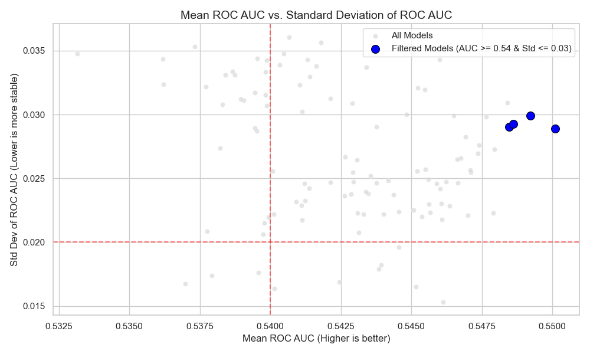
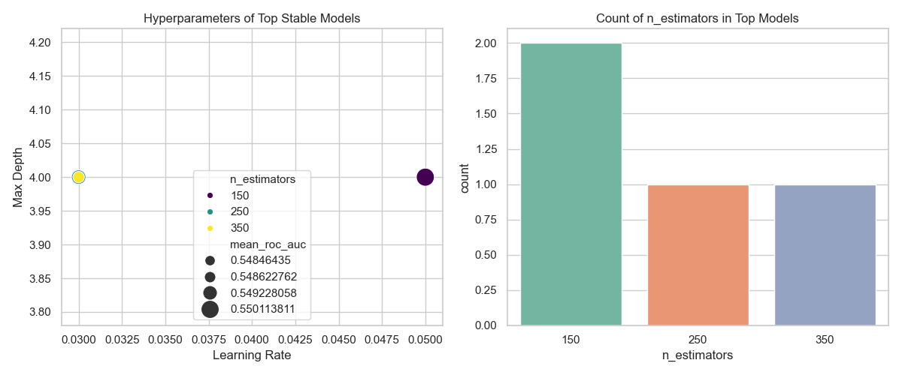
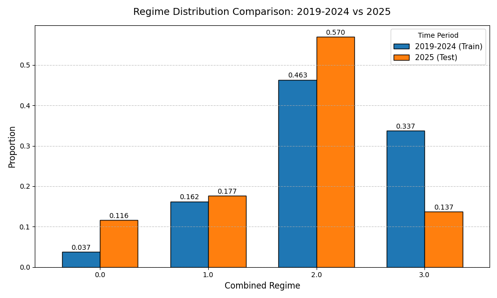
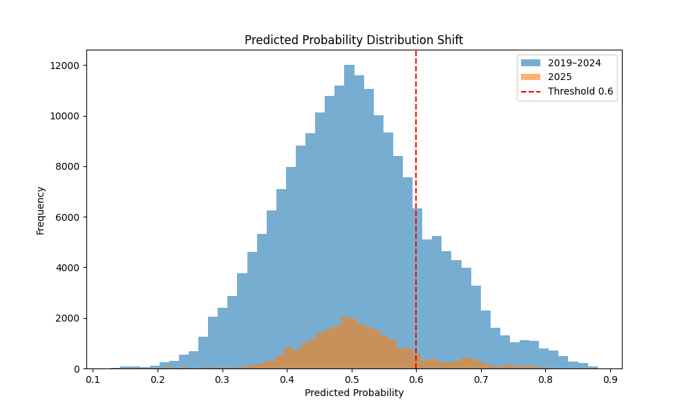
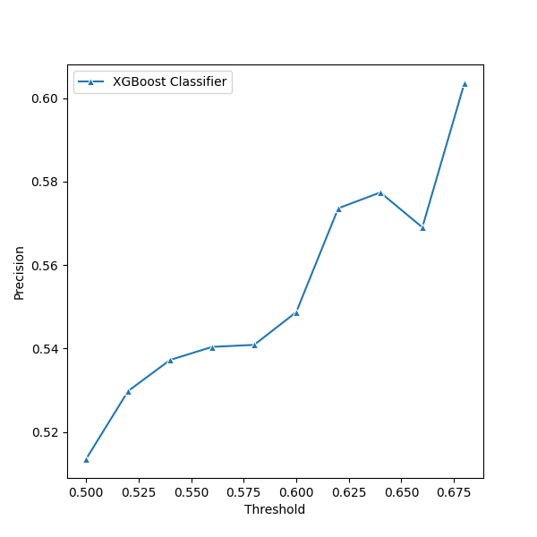
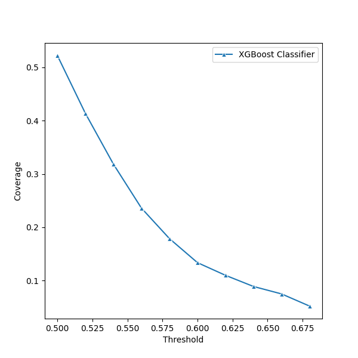
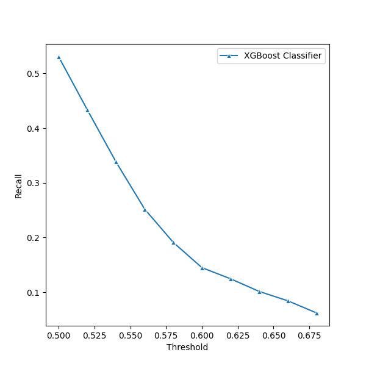

# Model 3 - Regime-Aware Framework (Walk-Forward Tuned)
## 1. Objective

Model 3 builds upon Model 2 by introducing structural market regime
awareness and performing systematic hyperparameter tuning.

The objective of this iteration was twofold:
1. Evaluate whether incorporating structural regime information improves cross-year stability.
2. Compare multiple tree-based models under identical walk-forward conditions.
3. Select the most stable model for hyperparameter tuning.
4. Evaluate the final generalization on an untouched 2025 holdout dataset.

The central hypothesis was:
```
Predictive performance is regime-conditional, and explicitly encoding structural market
state may improve generalization.
```

## 2. Feature Set
Model 3 retained:
* All stock-level technical indicators.
* All index-level features introduced in Model 2.

**Additional Feature Introduced**
`Combined_Regime`
Constructed using:
* Trend regime (based on Nifty 50 relative to 200-day SMA).
* Volatility regime (20-day volatility relative to training median).

Implementation details:
* `Trend Regime` and `Volatility Regime` were computed during pre-processing.
* These were not directly used as inputs.
* Only their interaction term (`Combined_Regime`) was included.
* Intermediate regime features were dropped prior to training.

This allowed structural state encoding without redundant dimensionality.

## 3. Experimental Setup
### 3.1 Walk-Forward Validation
An expanding-window walk-forward framework was applied from 2019 to 2024.

For each fold:
* Training used all data prior to the test year.
* Volatility median was computed using training data only.
* Regime interaction was derived using training thresholds.
* Model was trained on the training fold.
* Evaluation was performed on the subsequent year.

This preserved strict temporal integrity and avoided leakage.

The following models were evaluated:
* Random Forest
* XGBoost
* Voting Classifier (RF + XGB).

Following architecture selection, hyperparameter optimization was performed exclusively
on the strongest model using a 108-configuration grid search evaluated via the same
expanding yearly folds.

Final evaluation was performed on 2025, which was never using in walk-forward validation or tuning.

## 4. Results
### 4.1 Architecture Walk-Forward Comparison (2019-2024)

Under expanding-window validation:
* Random forest achieved moderate ranking ability (mean ROC-AUC ≈ 0.52-0.53).
* Voting Classifier performed similarly but did not meaningfully outperform standalone models.
* XGBoost demonstrated the strongest mean ROC-AUC (≈ 0.54 range) with acceptable
cross-year variance.

Based on ranking strength and stability, XGBoost was selected for hyperparameter optimization.

### 4.2 Hyperparameter Optimization (Walk-Forward Grid Evaluation)

A 108-configuration grid was evaluated using the same yearly folds.

Selection criteria:
* Highest mean ROC-AUC across folds.
* Controlled standard deviation.
* Stable precision and coverage behaviour.

The selected configuration achieved:
* Mean ROC-AUC ≈ 0.54-0.55
* Std ROC-AUC ≈ 0.02-0.03
* Precision @ 0.6 ≈ 0.60
* Coverage ≈ 18-22%

These results indicated moderate but persistent cross-year ranking ability.

Hyperparameter tuning improved cross-year stability but did not materially
expand ranking beyond the mid-0.50 AUC range.

<table style="border-collapse: collapse;">
<tr>
<td> </td>
<td> </td>
</tr>
</table>

### 4.3 Final Holdout Evaluation (2025)
The tuned XGBoost model was retrained on 2018-2024 and evaluated once on 2025.

Performance:
* ROC-AUC = 0.5075
* Precision @ 0.6 = 0.549
* Recall = 0.145
* Coverage = 13.3%

Performance degraded relative to walk-forward expectations.

### 4.4 Diagnostic Analysis

#### 4.4.1 Class Distribution Shift
Bullish prevalence:
* 2019-2024: 55.85%
* 2025: 50.55%

A modest reduction in bullish frequency was observed.

#### 4.4.2 Regime Distribution Shift
Combined_Regime proportions shifted materially in 2025:
* Regime 3 declined significantly.
* Regime 2 increased substantially.
* Regime 0 expanded meaningfully.

This reflects structural redistribution of market states.



#### 4.4.3 Predicted Probability Distribution Shift
Probability histograms revealed compression around 0.5 in 2025, with fewer high confidence
predictions above 0.6.

This indicates signal attenuation rather than model instability.



#### 4.4.4 Threshold Sensitivity Analysis (2025)

Across varying thresholds:
* ROC-AUC remained constant (~0.5075).
* Precision increased gradually with threshold.
* Coverage declined sharply at higher thresholds.
* No strong right-tail separation was observed.

Threshold tuning did not materially recover predictive separation.

<table style="border-collapse: collapse;">
<tr>
<td> </td>
<td> </td>
</tr>
<tr>
<td> </td>
<td> </td>
</tr>
</table>

## 5. Key Insights

1. Regime interaction improved cross-year stability during walk-forward validation.
2. XGBoost demonstrated superior ranking consistency relative to alternative architectures.
3. Hyperparameter optimization improved fold-level stability but did not significantly elevate ranking power.
4. Final holdout performance deteriorated due to distributional changes.
5. Structural regime redistribution in 2025 coincided with signal attenuation.
6. The predictive signal appears regime-conditional and sensitive to non-stationarity.
7. Threshold adjustment alone cannot compensate for weakened separation.

## 6. Conclusion

While regime interaction improved historical robustness, 2025 performance highlights the
persistent challenge of non-stationarity in financial time-series modeling.

The degradation observed in the holdout year coincided with:
* reduced bullish class prevalence.
* Redistribution of structural regimes.
* Compression of predicted probability distributions.

Model 3 reflects both improved modeling rigor and clear empirical evidence of
temporal instability under evolving market conditions.