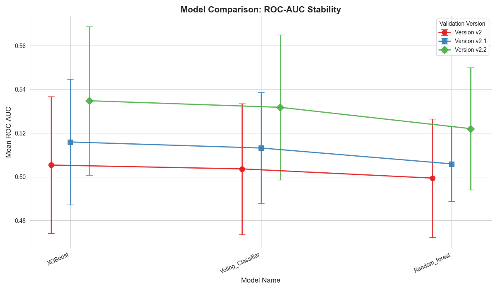

# V2 Model Walk-Forward Validation Report
<strong style="font-size: 18px;">Temporal Robustness Analysis Across Prediction Horizons (2019 - 2025)</strong>

## 1. Objective
The objective of this analysis is to evaluate the temporal generalization capability of the classification models
under different prediction horizons (5-day, 10-day, 15-day).

While prior evaluation relied on a single holdout year, this study applies expanding-window walk-forward validation to assess:
* Robustness under temporal distribution shift.
* Stability of class separation across market environments.
* Impact of prediction horizon on model performance.

This analysis focuses on structural model behaviour rather than single-period performance.

## 2. Methodology

### 2.1 Validation Framework
An expanding-window walk-forward validation was conducted for test years 2019-2025.
For each test year t:
* Training set: All data prior to year t.
* Test set    : Data within year t.
* No shuffling (chronology preserved).
* No leakage across folds.

This ensures realistic temporal generalization.

### 2.2 Models Evaluated
* Random Forest Classifier.
* XGBoost Classifier.
* Voting Ensemble.

All models were retrained for each fold.

### 2.3 Evaluation metric

Primary metric: ROC - AUC

Reason:
* Threshold-independent.
* Measures ranking quality.
* Robust to class imbalance.
* Suitable for structural comparison across horizons.

Mean and standard deviation of AUC across years were computed to assess stability.

## 3. Results

### 3.1 Mean ROC-AUC Across Horizons

 | Horizon | Random Forest | Voting Ensemble | XGBoost |
 |:-------:|:-------------:|:---------------:|:-------:|
 |  5-Day  |    ~0.499     |     ~0.504      | ~0.505  |
 | 10-Day  |    ~0.506     |     ~0.513      | ~0.516  |    
 | 15-Day  |    ~0.522     |     ~0.532      | ~0.535  |

### 3.2 AUC Standard Deviation Across Horizons

 | Horizon | Random Forest | Voting Ensemble | XG Boost |
 |:-------:|:-------------:|:---------------:|:--------:|
 |  5-Day  |    ~0.027     |     ~0.030      |  ~0.031  |
 | 10-Day  |    ~0.017     |     ~0.025      |  ~0.029  |
 | 15-Day  |    ~0.028     |     ~0.033      |  ~0.034  |

## 4. Observations

### 4.1 Short Horizon (5-Day)
* Mean AUC ≈ 0.50
* Performance near random baseline.
* Indicates dominance of short-term noise.

The model is unable to reliably separate classes at short horizons.

### 4.2 Medium Horizon (10-Day)
* Mild improvement in separability.
* Mean AUC ≈ 0.51 - 0.516
* Variance remains comparable.

Suggests partial reduction of noise, but signal remains modest.

### 4.3 Extended Medium Horizon (15-Day)
* Strongest mean separability (≈ 0.53-0.535).
* Variance comparable to shorter horizons.
* Consistent improvement across models.

This indicates that increasing the horizon reduces short-term label noise and enhances 
structural signal capture.

## 5. Temporal Stability Analysis
Across all horizons:
* Performance varies meaningfully year-to-year.
* Certain years exhibit stronger separability.
* Others approach random baseline.

This variability suggests sensitivity to temporal distribution shifts in the feature-target relationship.

However:
* The 15-day horizon maintains improved performance without disproportionate variance increase.
* The signal remains modest but non-random.

## 6. Interpretation

Key findings:
1. Increasing prediction horizon improves class separability.
2. Short-term movement are largely noise-dominated.
3. Medium-term dynamics exhibit modest persistence.
4. Model performance is sensitive to changing market structure.
5. Ensemble methods do not eliminate temporal sensitivity but maintain comparable performance.

The results indicate that the current feature set captures some structural signal, though robustness across regimes remains limited.

## 7. Conclusion
Walk-forward validation across 2019-2025 demonstrates that:
* The modeling framework exhibits modest but measurable predictive ability.
* A 15-day horizon provides the strongest structural separability.
* Performance variability across years indicates exposure to temporal distribution shifts.

Within the current feature configuration, the 15-day horizon is structurally preferable,
offering improve signal strength without materially increase instability.

Future improvements should focus on incorporating regime-aware modeling strategies to enhance robustness under shifting market conditions.