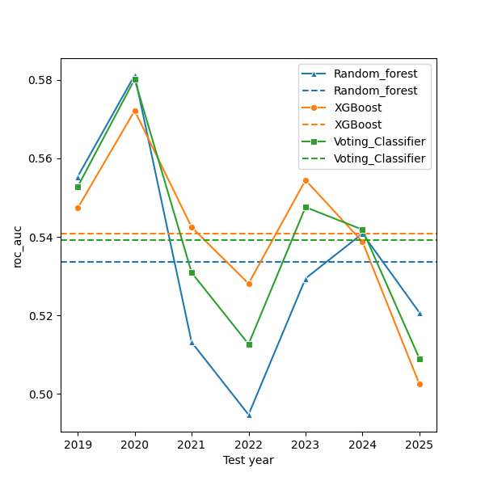
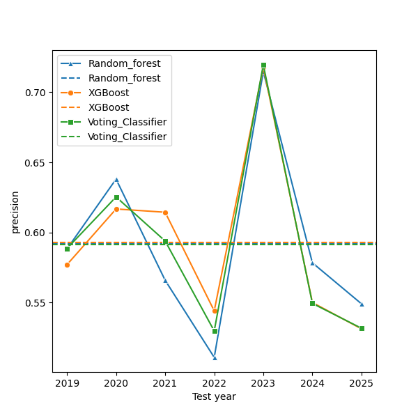
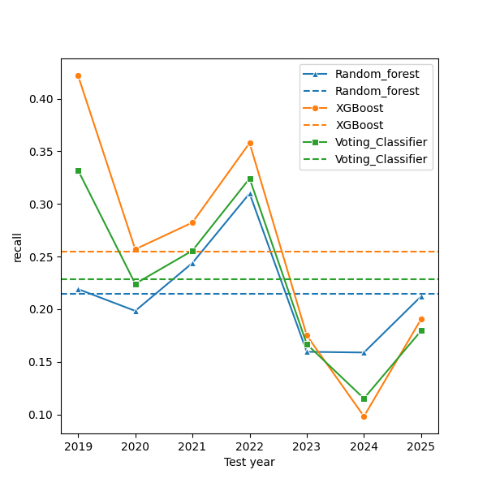
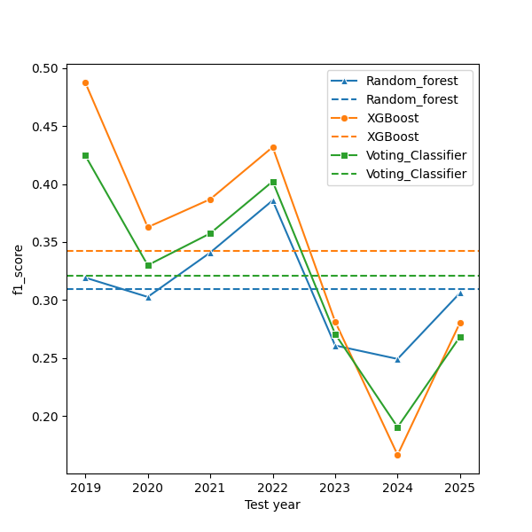

# Model 3 - Walk-Forward Validation Report
## 1. Background and Motivation
Model 2 incorporated market-level index features and evaluated multiple forecasting
horizons to improve class separability. Controlled experiments revealed several structural characteristics:
* Short-horizon forecasts (5-10 trading days) exhibited weak separability (ROC-AUC ≈ 0.50-0.51), indicating noise-dominated behaviour.
* Extending the horizon to 15 trading days materially improved performance (ROC-AUC ≈ 0.52-0.53), suggesting that the predictive
signal expresses more clearly over medium-term windows.

While horizon alignment improved separability, performance variability across different
market periods suggested potential sensitivity to structural market conditions.

This led to the following hypothesis:
```
Predictive separability may be conditionally dependent on underlying market regime
```

## 2. Hypothesis
Financial markets exhibit regime-dependent dynamics characterized by shifts in trend
persistence and volatility structure. Technical indicators may behave differently across:
* Bull vs. Bear trend environments.
* Low-volatility vs. High-volatility conditions.

If the predictive signal is not stationary across regimes, explicitly encoding structural
market state may improve conditional class separability.

## 3. Regime-Aware Feature Construction
To test this hypothesis, a structural regime feature was introduced using Nifty 50 as the
primary market reference.

### 3.1 Trend Regime
Trend state was defined using the 200-day simple moving average:
* Bull regime (1): Index Close > 200-day SMA.
* Bear regime (0): Otherwise.
This captures long-term structural direction

### 3.2 Volatility Regime
Volatility state was defined using 20-day rolling volatility of index returns.

To prevent data leakage, the volatility threshold was computed within each walk-forward
training fold as the median historical volatility of that fold.

Observations were classified as:
* High Volatility (1): Volatility > training-fold median.
* Low Volatility (0) : Otherwise.

### 3.3 Combined Structural State
The final regime feature was encoded as:
```
Combined_Regime = (Trend_Regime * 2) + Vol_Regime
```

This yielded four structural market states:
* Bear + Low Volatility.
* Bear + High Volatility.
* Bull + Low Volatility,
* Bull + High Volatility.

Importantly, raw magnitude features such as the 200-day SMA were removed to isolate
structural state effects and avoid scale-driven decision splits.

## 4. Horizon Sensitivity Under Regime Encoding
Performance was evaluated across multiple forecast horizons using walk-forward validation.

 | Horizon | Mean ROC-AUC |    Interpretation     |
 |:-------:|:------------:|:---------------------:|
 | 10-Day  |    ~0.50     | Limited separability  |
 | 15-Day  |    ~0.54     | Strongest performance |
 | 20-Day  |    ~0.53     |   Mild degradation    |

This 15-day horizon provided the most favorable trade-off between short-term noise
reduction and potential long-term regime contamination.
This configuration was selected as the primary Model-3 architecture.

## 5. Walk-forward Validation (15-Day Configuration):

An expanding-window walk-forward validation (2019-2025) was conducted.

### 5.1 Mean ROC-AUC
* Random Forest: 0.5336
* Voting Classifier: 0.5393
* XGBoost: 0.5408

### 5.2 Standard Deviation
* Random Forest: 0.0286
* Voting Classifier: 0.0246
* XGBoost: 0.0218

XGBoost achieved both the highest mean separability and the lowest temporal instability
across folds.

## 6. Temporal Performance Characteristics
Walk-forward evaluation revealed non-uniform predictive behaviour across market cycles.

### 6.1 Strong Performance During Trending Periods
Performance was strongest during structurally trending periods (e.g. 2020), where all
models achieved ROC-AUC values above 0.57. These environments exhibited clearer
directional persistence and stronger separability.

### 6.2 Weaker performance During Transitional Periods
Transitional or choppy market conditions (e.g., 2022) exhibited reduced separability,
particularly for bagging-based models such as Random Forest. Boosting-based models (XGBoost)
demonstrated comparatively higher resilience during these periods.

### 6.3 Precision-Recall Dynamics
Classification behaviour varied across years:
* Certain periods exhibited high-precision, but low-recall behaviour, indicating increased model
selectivity.
* Other periods showed more balanced recall, suggesting broader signal capture.
These dynamics further support the hypothesis that predictive behaviour is conditionally
dependent on structural market state.

<table style="border-collapse: collapse;">
<tr>
<td></td>
<td></td>
</tr>
<tr>
<td></td>
<td></td>
</tr>
</table>

## 7. Key Findings
1. Explicit regime encoding improved class separability relative to model 2.
2. Structural categorical encoding outperformed raw magnitude trend inputs.
3. Predictive performance is highly sensitive to forecast horizon.
4. The signal exhibits strongest persistence in the medium term (~15 trading days).
5. Regime-awareness reduced instability and improved robustness across multiple
market cycles.
6. XGBoost demonstrated superior stability compared to bagging-based approaches.

## 8. Conclusion
Model 3 demonstrates that directional prediction performance in equity markets is
conditionally dependent on structural market regime. Incorporating regime-awareness
materially improved both mean ROC-AUC and temporal stability relative to prior iterations.

The 15-day regime-aware configuration forms the current baseline architecture and provides
a structurally validated foundation for subsequent hyperparameter refinement and
deployment evaluation.

## 9. Limitations and Future Directions
### 9.1 Limitations
#### 1. Moderation Absolute Separability
Although Model 3 improved mean ROC-AUC to approximately 0.54, the absolute magnitude of
separability remains modest. This reflects the intrinsic difficulty of short-to-medium
term equity direction prediction, where signal-to-noise ratio is structurally low.

The model captures a weak but statistically consistent edge rather than strong deterministic predictability.

#### 2. Regime Simplification
Market regime was defined using a binary trend filter (200-day SMA) and a volatility threshold. While effective,
this representation simplifies structural market dynamics and may not fully capture transitional or multi-factor regime states.

More granular regime modeling may further refine conditional separability.

#### 3. Cross-Sectional Pooling
The model was trained across multiple stocks simultaneously. While this increases sample size and generalization capacity,
it assumes that predictive structure is sufficiently homogeneous across securities. Asset-specific structural differences may limit optimality.

#### 4. No Transaction Cost Modeling
Model evaluation focused on classification separability rather than realized trading performance. Transaction costs, slippage, and turnover
effects were not incorporated. As a result, economic profitability was not assessed at this stage.

### 9.2 Future Directions
Based on Model 3 findings, the following research directions are proposed:

#### 1. Controlled Hyperparameter Optimization
Perform structured tuning within the fixed 15-day regime-aware architecture to assess whether separability can be improved without increasing temporal instability.

#### 2. Regime specific modeling\
Instead of conditioning on regime within a single model, separate models could be trained
for each structural regime. This may allow the classifier to specialize its decision boundaries.

#### 3. Feature Interaction Expansion
Explore interaction-based or cross-feature representations between stock-level technical indicators and regime state to better capture conditional behaviour.

#### 4. Trading Performance Evaluation
Translate classification outputs into simulated trading signals and evaluate risk-adjusted performance metrics such as Sharpe ratio, drawdown, and turnover-adjusted returns.


